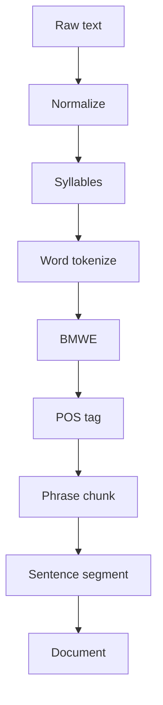

# BurmeseNLP

<p align="center">
  
</p>

**BurmeseNLP** (`burmesenlp`) is an open-source Python library for **rule-based**
Myanmar (Burmese) natural language processing.

Version **1.0** focuses on preprocessing: normalization, Zawgyi ↔ Unicode,
syllable / word / sentence segmentation, multi-word expressions (BMWE),
lexicon management, rule-based POS tagging, and phrase chunking.

```bash
pip install burmesenlp
```

```python
from burmesenlp import process

doc = process("ကျွန်တော်ကျောင်းသို့သွားသည်။")
print(doc.words)
# ['ကျွန်တော်', 'ကျောင်း', 'သို့', 'သွား', 'သည်', '။']
```

## Pipeline (V1)



## What you get

| Capability | Module |
| --- | --- |
| Full pipeline | `process` / `BurmeseNLP` |
| Syllable / word / sentence | `tokenize` |
| Multi-word idioms | `mwe` |
| POS tags | `tag` |
| Phrase chunks | `chunking` |
| Lexicon | `lexicon` |
| Zawgyi ↔ Unicode | `zawgyi` |

## Next steps

- [Installation](getting-started/installation.md)
- [Quickstart](getting-started/quickstart.md)
- [User guide](user-guide/index.md)
- [API reference](api/index.md)
- [References](references.md)

## License

Apache-2.0 — see the repository `LICENSE` file.
